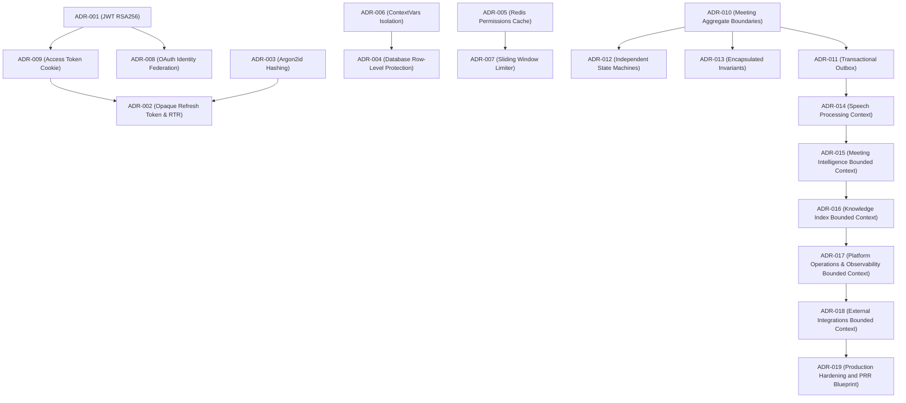

# Architecture Decision Records (ADRs)

This directory captures all significant architectural decisions made during the development of the **Noted Ma'am** backend and domain subsystems.

Each record follows the MADR (Markdown Architecture Decision Records) format.

---

### ADR Lifecycle Definition
To ensure consistency across the project lifecycle, each record conforms to one of the following lifecycle states:
* `Proposed`: Under active design review.
* `Accepted`: Signed off by the architecture board.
* `Implemented`: Code changes completed and verified via tests.
* `Deprecated`: Retained for historical tracking but no longer recommended.
* `Superseded`: Replaced by a newer decision.

---

### Decision Dependency Graph

---

### Master Index

| ADR ID | Decision Title | Category | Status | Supersedes / Superseded By | Impacted Components | Implementation Source | Rejected Alternative ("Why Not?") |
| :---: | :--- | :---: | :---: | :---: | :--- | :--- | :--- |
| **[ADR-001](adr-001-jwt-rsa256.md)** | JWT Signatures — RS256 with JWKS | Security | `Implemented` | None / None | `IAMMiddleware`, `JWKSManager` | [jwks.py](../../app/core/jwks.py), [iam.py](../../app/core/iam.py) | **HS256 symmetric signing**: Symmetric keys must be shared across all microservices, leading to key leak vectors. |
| **[ADR-002](adr-002-refresh-token-rotation.md)** | Session Revocation via RTR | Security | `Implemented` | None / None | `IdentityService`, Auth DB models | [identity.py](../../app/services/identity.py), [auth.py](../../app/models/auth.py) | **Stateless JWT revocation blacklist**: Checking blacklisted tokens on every request introduces high Redis write overhead. |
| **[ADR-003](adr-003-argon2id-password-hashing.md)** | Argon2id Password Cryptography | Security | `Implemented` | None / None | `security.py`, auth routes | [security.py](../../app/core/security.py) | **bcrypt or PBKDF2**: Highly vulnerable to custom GPU/ASIC parallel brute-force attacks. |
| **[ADR-004](adr-004-postgresql-rls.md)** | Workspace Isolation & Row-Level Write Protection | Security | `Implemented` | None / None | Database sessions, write flushes | [database.py](../../app/core/database.py) | **Application-layer filtering**: Relying on developers to append `where workspace_id` to every query is highly error-prone. |
| **[ADR-005](adr-005-redis-permission-cache.md)** | Redis Permissions Cache | Performance | `Implemented` | None / None | `IAMMiddleware`, Redis client | [iam.py](../../app/core/iam.py) | **Direct DB RBAC Queries**: Querying PostgreSQL RBAC tables on every request introduces database bottlenecking. |
| **[ADR-006](adr-006-contextvars-workspace-isolation.md)** | Request-scoped Context Variables | Infrastructure | `Implemented` | None / None | `ContextVars` manager, DB engine | [iam.py](../../app/core/iam.py), [database.py](../../app/core/database.py) | **thread.local storage context**: Async loops yield control, leading to variables leaking across concurrent requests. |
| **[ADR-007](adr-007-sliding-window-rate-limiter.md)** | Sliding Window Rate Limiting | Performance | `Implemented` | None / None | Rate limiting middleware | [rate_limiter.py](../../app/core/rate_limiter.py) | **Fixed-window counter**: Permits double-quota traffic spikes at window boundaries. |
| **[ADR-008](adr-008-oauth-external-idp-framework.md)** | OAuth2 Federated Identity Providers | Authentication | `Implemented` | None / None | Auth callback routes, OAuth registry | [identity_providers.py](../../app/core/identity_providers.py), [auth.py](../../app/api/auth.py) | **Hardcoded social login callbacks**: Couples auth endpoints to specific provider clients, preventing multiple IdPs. |
| **[ADR-009](adr-009-access-token-lifecycle.md)** | Short-Lived Access Token Lifetime | Security | `Implemented` | None / None | Token generation, cookie parser | [identity.py](../../app/services/identity.py), [auth.py](../../app/api/auth.py) | **LocalStorage access token storage**: stored tokens are vulnerable to cross-site scripting (XSS) extraction. |
| **[ADR-010](adr-010-meeting-aggregate-boundaries.md)** | Meeting Aggregate Boundaries | Domain | `Implemented` | None / None | Meeting domain classes, participant profiles | [meeting.py](../../app/models/meeting.py), [meeting.py](../../app/api/meeting.py) | **Anemic database CRUD models**: Splits state rules from entities, enabling invalid state mutations. |
| **[ADR-011](adr-011-transactional-outbox.md)** | Transactional Outbox Pattern | Eventing | `Implemented` | None / None | Outbox tables, dispatcher poller | [events.py](../../app/infrastructure/events.py) | **Direct Redis/Kafka publishing**: DB commit success combined with publisher failure causes lost messages. |
| **[ADR-012](adr-012-separated-meeting-states.md)** | Independent Lifecycle and Processing State Machines | Domain | `Implemented` | None / None | Meeting aggregate state rules | [meeting.py](../../app/models/meeting.py) | **Single global processing status**: Combining lifecycle and speech states leads to state space explosion. |
| **[ADR-013](adr-013-meeting-aggregate-invariants.md)** | Meeting Aggregate Invariants | Domain | `Implemented` | None / None | Meeting aggregate validation rules | [meeting.py](../../app/models/meeting.py) | **Controller-layer validations**: Business logic shifts to API endpoints, creating duplicate logic. |
| **[ADR-014](adr-014-speech-processing-context.md)** | Speech Processing Bounded Context | Domain Architecture | `Implemented` | None / None | Transcript models, speech service, speech worker | [meeting.py](../../app/models/meeting.py), [speech.py](../../app/services/speech.py), [speech_worker.py](../../app/workers/speech_worker.py) | **Embed transcription in Meeting Domain**: Couples AI model dependencies into the core domain, violating single responsibility. |
| **[ADR-015](adr-015-meeting-intelligence-context.md)** | Meeting Intelligence Bounded Context & Staged Validation | Domain Architecture | `Implemented` | None / None | Artifact models, intelligence service, intelligence worker | [meeting.py](../../app/models/meeting.py), [intelligence.py](../../app/services/intelligence.py), [intelligence_worker.py](../../app/workers/intelligence_worker.py) | **Direct LLM execution inside endpoints**: Processing runs for seconds/minutes and must run asynchronously via pipeline. |
| **[ADR-016](adr-016-knowledge-index-context.md)** | Knowledge Index Bounded Context & Hybrid Retrieval | Domain Architecture | `Implemented` | None / None | Chunk & Embedding models, knowledge service, indexing worker | [meeting.py](../../app/models/meeting.py), [knowledge.py](../../app/services/knowledge.py), [indexing_worker.py](../../app/workers/indexing_worker.py) | **Direct keyword search**: Low semantic recall. Couples indexer into Meeting Intelligence context violating single responsibility. |
| **[ADR-017](adr-017-observability-context.md)** | Platform Operations and Observability Bounded Context | Domain Architecture | `Implemented` | None / None | Tracing middleware, ContextVars, metrics collector, health routes | [tracing.py](../../app/core/tracing.py), [metrics.py](../../app/core/metrics.py), [health.py](../../app/api/health.py) | **Context-less raw logs / inline APMs**: Restricts custom dashboard mappings and leaks thread context under async concurrent loops. |
| **[ADR-018](adr-018-integrations-context.md)** | External Integrations Bounded Context | Domain Architecture | `Implemented` | None / None | Config & Outbox models, integration service, integrations worker | [meeting.py](../../app/models/meeting.py), [integrations.py](../../app/services/integrations.py), [integration_worker.py](../../app/workers/integration_worker.py) | **Inline worker API dispatches**: Saturation/latencies block core transactional pipeline. Webhook secret leakage risks. |
| **[ADR-019](adr-019-production-platform.md)** | Production Hardening and PRR Blueprint | Operations Architecture | `Implemented` | None / None | Helm charts, Terraform, CI/CD signing, Chaos mesh, load tests | [production_readiness_review.md](../operations/production_readiness_review.md) | **Direct deployment manifests**: Lacks automated canary validation pipelines and structured disaster recovery playbooks. |

---

### Review Metadata

* **Owner**: Backend Architecture Group
* **Security Review Board**: Signed Off (2026-07-09)
* **Domain Review Board**: Signed Off (2026-07-10)
* **Last Updated**: 2026-07-10
