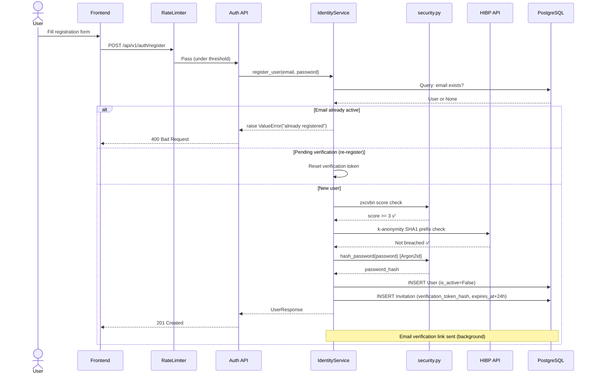
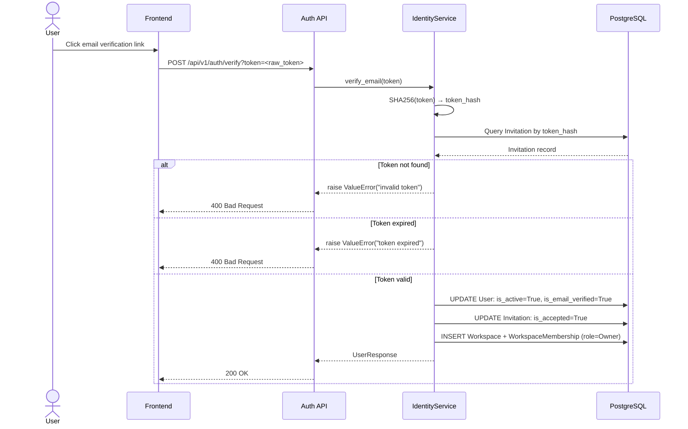
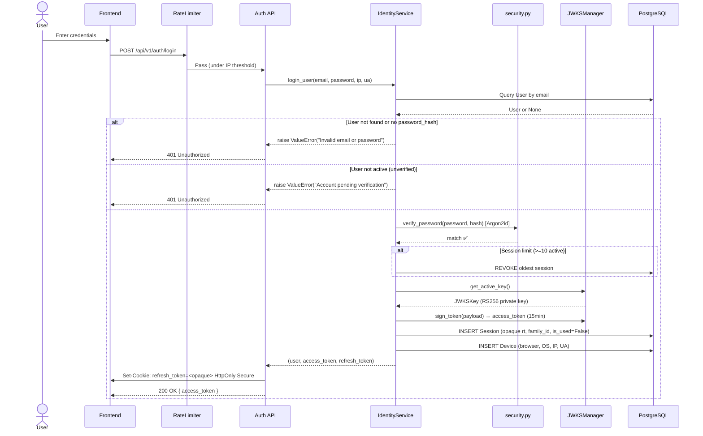
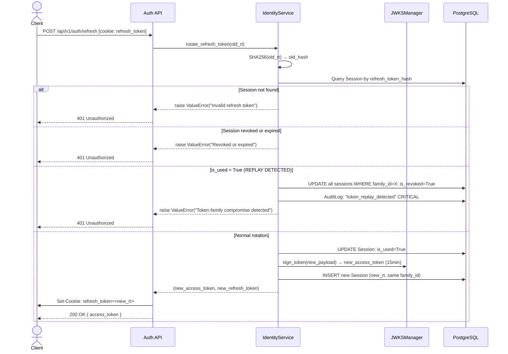
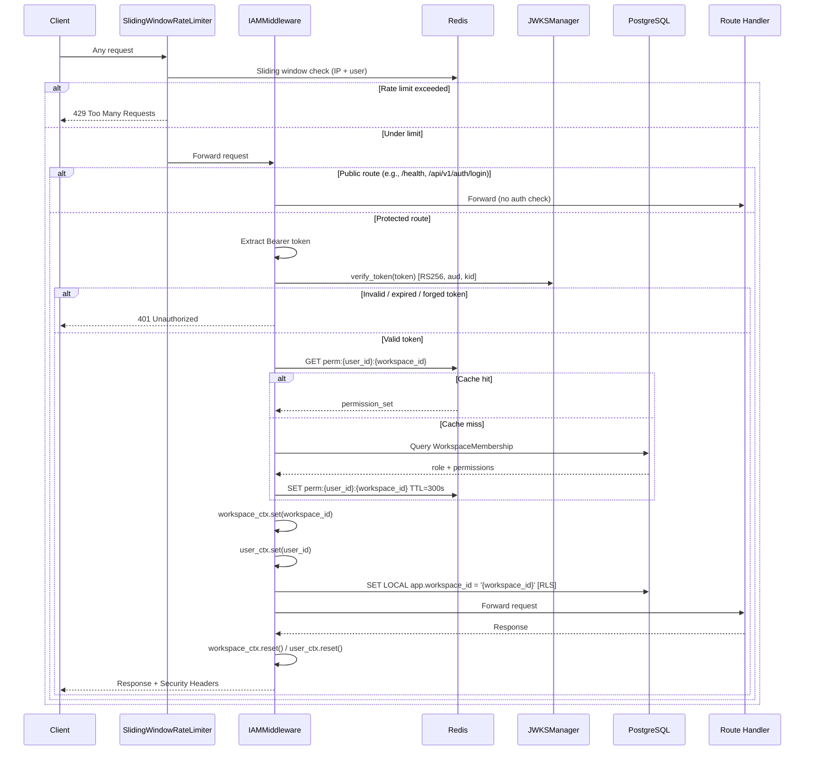
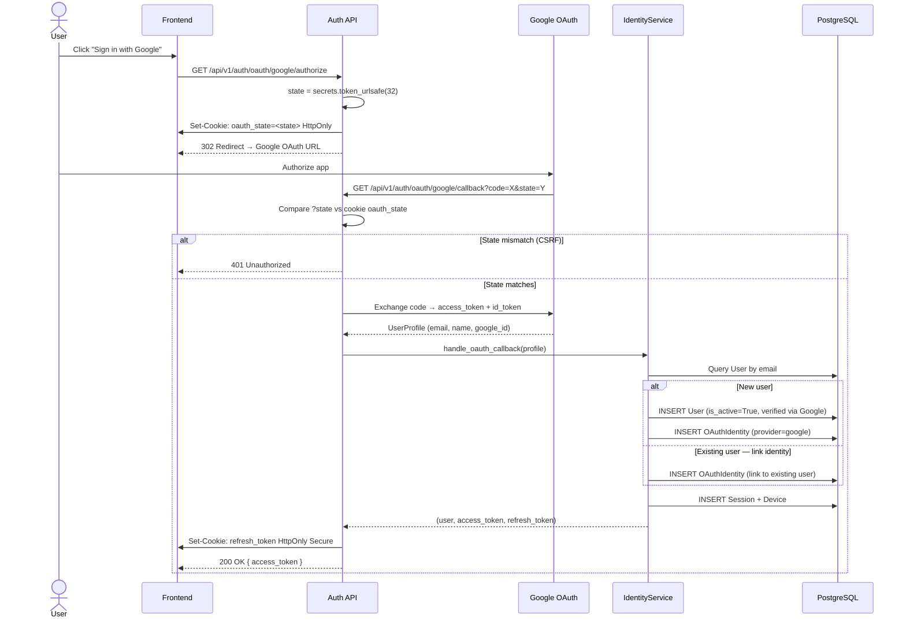
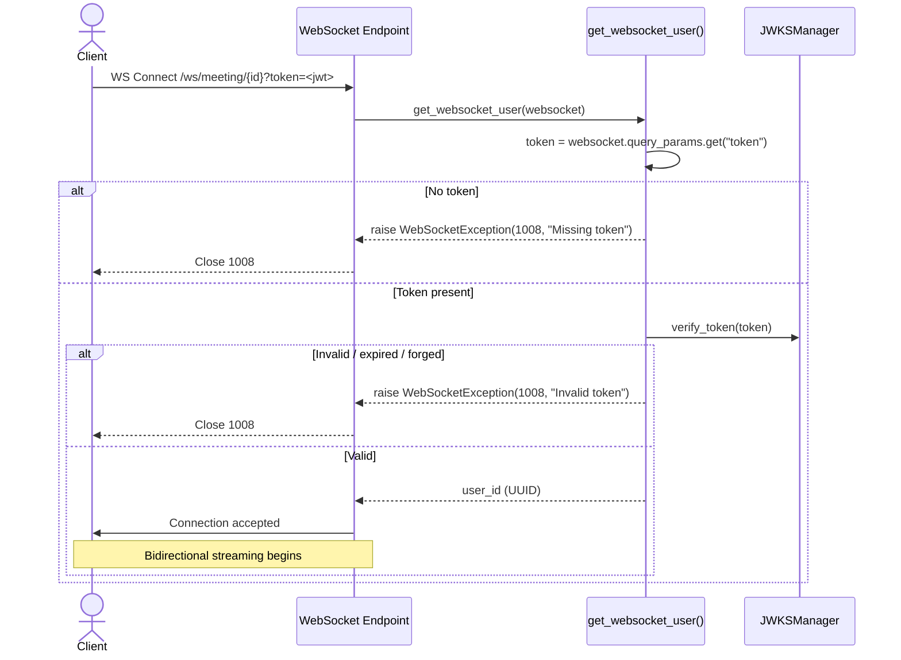

# Authentication Sequence Diagrams

Sequence diagrams for all authentication and session management flows in the
Noted Ma'am Identity Service. These diagrams are normative — implementation
must match.

---

## 1. Registration Flow

---

## 2. Email Verification Flow

---

## 3. Login Flow

---

## 4. Token Refresh + RTR Replay Detection

---

## 5. IAM Middleware Request Pipeline

---

## 6. Google OAuth Flow

---

## 7. WebSocket Authentication Handshake

