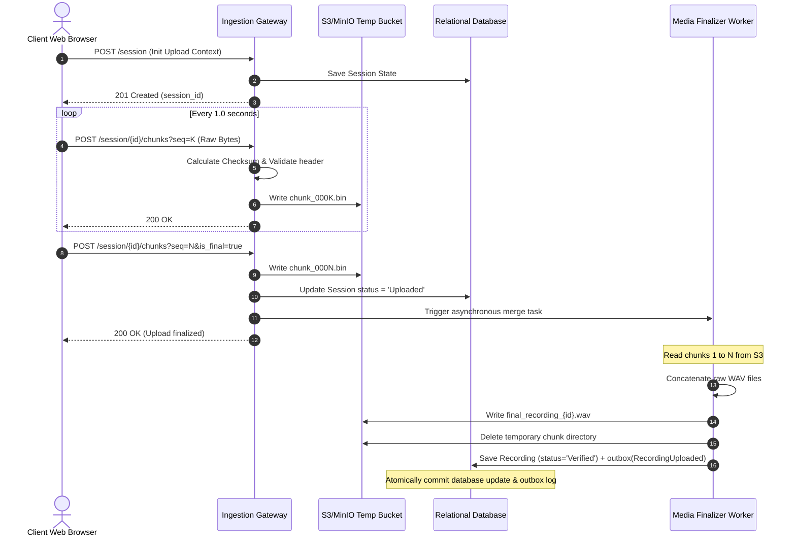

# RFC-001: Media Ingestion & Chunked Audio Streaming Pipeline

This RFC outlines the architectural design for real-time media ingestion, chunked audio streaming, Voice Activity Detection (VAD), and recording finalization within the **Noted Ma'am** Meeting Operating System.

---

## 1. Executive Summary & Design Goals
The goal of the Media Ingestion Subsystem is to capture high-fidelity, low-latency audio streams from meeting participants, process them for Voice Activity Detection (VAD) and silence trimming, and securely index raw audio segments in storage while raising event-driven triggers for downstream ASR workers.

### Core Objectives
* **Low Latency**: Limit client-to-storage ingestion delay to under 1.5 seconds.
* **Network Resilience**: Guarantee packet/chunk-loss protection over unstable connections using client-side buffers and index sequence numbers.
* **Storage Optimization**: Save up to 40% of storage cost by detecting silence and trimming quiet segments prior to permanent S3 storage.
* **Decoupled Architecture**: Isolate ingestion routing gateway logic from ASR execution pipelines via event-driven outbox events.

---

## 2. Ingestion Protocols & Architectures

We evaluated two communication methods for audio ingestion:

| Protocol | Advantages | Disadvantages | Selection Rationale |
| :--- | :--- | :--- | :--- |
| **WebRTC Media Gateway** (RTCDataChannel or RTP) | Sub-100ms real-time latency, built-in congestion controls. | High CPU infrastructure cost (SFU/MCU hosting), STUN/TURN overhead. | Chosen as the **Proposed Design** for low-latency browser participation. |
| **HTTP Chunked POST Protocol** | Simplified load-balancing, standard TCP retries, stateless APIs. | Slightly higher latency (~1-2s delay due to chunking window). | Chosen as the **Implemented Today** mechanism for chunk upload verification. |

### WebRTC Connection Orchestration
```
Client Browser (WebRTC Peer)
       │
       │ (1. SDP Offer via HTTP POST /api/v1/media/sessions)
       ▼
Uvicorn / FastAPI signaling gateway
       │
       │ (2. ICE candidate verification & SDP Answer)
       ▼
Media Gateway (python-aiortc)
       │
       │ (3. RTP mono audio payload stream)
       ▼
Chunk Ingestion Processor
```

---

## 3. Ingestion API & Chunk Protocol

To ensure structured, ordered delivery of audio data over unstable connections, the platform exposes a chunked streaming API:

### API Endpoints

#### 1. Initialize Media Session
* **Endpoint**: `POST /api/v1/meeting/{meeting_id}/media/session`
* **Purpose**: Registers a new media upload stream context.
* **Payload**:
  ```json
  {
    "codec": "audio/wav",
    "sample_rate": 16000,
    "channels": 1,
    "bitrate": 256000
  }
  ```
* **Response**: `201 Created` with a `session_id` (UUID).

#### 2. Stream Audio Chunk
* **Endpoint**: `POST /api/v1/meeting/{meeting_id}/media/session/{session_id}/chunks`
* **Headers**: `Content-Type: application/octet-stream`
* **Query Parameters**:
  * `sequence_number` (int): Incremental 1-indexed counter.
  * `is_final` (boolean): Flags the final chunk.
  * `checksum` (string): Hex-encoded SHA-256 hash of the chunk payload.
* **Response**: `200 OK` on successful validation.

---

## 4. Voice Activity Detection (VAD) & Silence Trimming

To prevent storing quiet rooms and wasting GPU transcriber cycles, the ingestion parser incorporates an inline VAD processor using `webrtcvad`.

```
[Incoming PCM Audio Chunk]
           │
           ▼
[Format conversion: Mono 16kHz PCM (320-sample frame window)]
           │
           ▼
[webrtcvad.Vad(aggressiveness=2)]
           │
     ┌─────┴──────────┐
     ▼ Active         ▼ Silent
[Preserve Audio]  [Count silent duration]
     │                │
     ▼                ├───────────────────┐
[S3 Chunk Write]      ▼ Silent < 2.0s     ▼ Silent >= 2.0s
                      [Preserve Audio]    [Trim & Skip Write]
```

### Invalidation & Trimming Parameters
* **Frame Size**: 30ms frames (480 samples at 16kHz sample rate).
* **Aggressiveness Level**: 2 (Moderate balance between false-positives and missed speech tails).
* **Silence Threshold**: Quiet segments lasting longer than 2.0 seconds are dropped from permanent storage, leaving logical gap markers in the transcript timeline.

---

## 5. Storage Layout & Processing

Chunks are stored as independent blocks inside a temporary scratchpad bucket to allow out-of-order writes and dynamic retries.

### Bucket Layout
```text
noted-maam-media/
└── workspaces/
    └── {workspace_id}/
        └── meetings/
            └── {meeting_id}/
                ├── temp_session_{session_id}/
                │   ├── chunk_000001.bin
                │   ├── chunk_000002.bin
                │   └── chunk_000003.bin
                └── final_recording_{recording_id}.wav
```

### Merging & Verification Flow
Once the final chunk is received (`is_final = true`):
1. **Sequence Check**: Verify that all sequence numbers from `1` to `N` exist in the temporary folder.
2. **Assembler**: Stream each chunk file sequentially, concatenating them into a single final WAV file.
3. **Checksum Verification**: Re-compute the SHA-256 checksum of the merged output and verify it matches the client's cumulative manifest hash.
4. **Cleanup**: Delete the temporary directory folder `temp_session_{session_id}/`.
5. **Publish Event**: Save outbox event logs, triggering `RecordingUploaded` for transcription queues.

---

## 6. Failure Recovery, Retries, & Backpressure

### Network Interruptions & Chunks Out of Order
* **Client Buffer**: The client holds an in-memory queue of the last 5 sent chunks.
* **Sequence Index Check**: The backend verifies sequence numbers. If sequence `K` is missing, the backend returns a `409 Conflict` (requesting re-submission of chunk `K` before processing chunk `K+1`).
* **Session Expiry**: Temporary folders are automatically cleaned up if no chunk has been received for 15 minutes.

### Backpressure Control
* **API Rate Limiter**: The sliding window rate limiter prevents clients from flood-uploading chunks faster than `1.2x` realtime playback speeds (except during crash recovery replays).
* **Worker Throttling**: The ASGI threadpool limits concurrent chunk validation workers to `50` to prevent CPU exhaustion.

---

## 7. Event Sequence Flow


