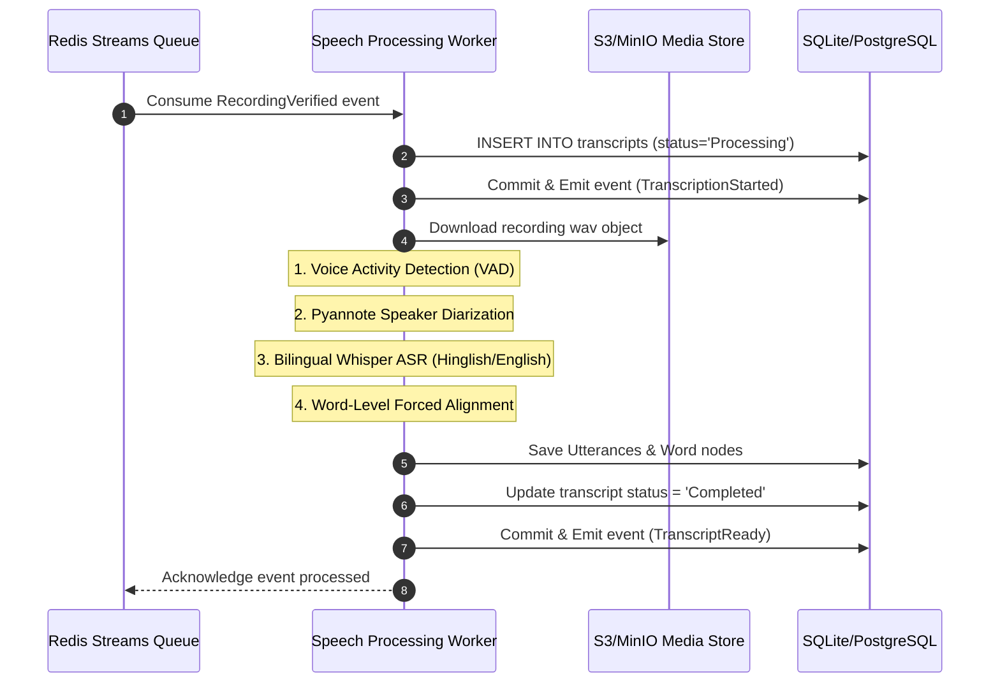

# RFC-002: Speech Processing Bounded Context

This RFC defines the architectural boundaries, schema layouts, worker topologies, and integration guidelines for the **Speech Processing Context** within the **Noted Ma'am** Meeting Operating System.

---

## 1. Context Boundaries & Responsibilities

The Speech Processing Context is a dedicated downstream consumer context. Its sole responsibility is to translate raw audio media assets into structural transcript objects. 

```
[Media Ingestion Context]
          │
          │ (RecordingVerified Event)
          ▼
┌─────────────────────────────────────────────────────────────────┐
│ Speech Processing Context                                       │
│                                                                 │
│  [RecordingVerified Consumer] ──> [Whisper ASR / Pyannote]       │
│                                           │                     │
│                                           ▼                     │
│                                  [Transcript Aggregate]         │
│                                           │                     │
│                                           ▼                     │
│                                 (TranscriptReady Event)         │
└─────────────────────────────────────────────────────────────────┘
                                            │
                                            ▼
                               [AI MOM & Analytics Context]
```

### Core Invariants
* **Decoupling**: The speech context does not perform task extraction, MOM summarization, or semantic vector search.
* **Original Utterance Preservation**: Original spoken Hinglish strings are retained permanently inside the database. Optional translations or edits are linked as dependent attributes, preserving the historical source material.
* **Worker Isolation**: ASR inference tasks execute inside background workers separate from the FastAPI API HTTP threadpool.

---

## 2. Domain Model & Schema Design

Transcripts are stored utilizing a highly granular, hierarchical aggregate structure:

```
Transcript (Aggregate Root)
    ├── transcript_id (UUID)
    ├── meeting_id (UUID)
    ├── recording_id (UUID)
    ├── language_hint (string)
    ├── utterances (One-to-Many List)
    │     ├── utterance_id (UUID)
    │     ├── speaker_id (string)
    │     ├── text (string)
    │     ├── start_ms (int)
    │     ├── end_ms (int)
    │     └── confidence (float)
    └── words (One-to-Many List)
          ├── word_id (UUID)
          ├── utterance_id (UUID)
          ├── word (string)
          ├── start_ms (int)
          ├── end_ms (int)
          └── confidence (float)
```

### Relational Database Table Mappings

#### 1. `transcripts`
* `id`: `UUID` (Primary Key)
* `meeting_id`: `UUID` (Foreign Key -> meetings)
* `recording_id`: `UUID` (Foreign Key -> recordings)
* `status`: `String` (Pending, Processing, Completed, Failed)
* `created_at`: `DateTime`
* `completed_at`: `DateTime` (Nullable)

#### 2. `utterances`
* `id`: `UUID` (Primary Key)
* `transcript_id`: `UUID` (Foreign Key -> transcripts)
* `speaker_tag`: `String` (e.g. "SPEAKER_00", linked to participants later)
* `text`: `Text` (Original Hinglish/English utterance)
* `start_time`: `Float` (Seconds from start)
* `end_time`: `Float` (Seconds from start)
* `confidence`: `Float`

#### 3. `words`
* `id`: `UUID` (Primary Key)
* `utterance_id`: `UUID` (Foreign Key -> utterances)
* `word`: `String` (Individual word string)
* `start_time`: `Float`
* `end_time`: `Float`
* `confidence`: `Float`

---

## 3. Worker Topology & Execution Pipeline

ASR workers are stateless background subprocesses that poll message queues or consume event streams.



---

## 4. Model Integrations

### 1. Bilingual Whisper ASR
* **Model Size**: Faster-Whisper `medium` or `large-v3` running in FP16 mode.
* **Multilingual Configuration**: Initialized with English/Hindi language priors. Code-switching is handled dynamically by Whisper's attention layers.
* **Decoding Parameters**: `beam_size = 5`, temperature fallback loops disabled to ensure deterministic latency bounds.

### 2. Pyannote Diarization
* **Model**: `pyannote/speaker-diarization-3.1` (or local embedding clustering).
* **Execution**: Maps audio segments to relative speaker IDs (`SPEAKER_00`, `SPEAKER_01`).
* **Confidence Bounds**: Calculates diarization probability distributions based on spatial audio clusters.

---

## 5. Failure recovery & Backpressure Strategy

* **Task Timeout**: Workers are bounded to a maximum processing window of `0.5x` recording duration. If a task exceeds this limit, the worker terminates it, sets transcript status to `Failed`, and releases the queue lease.
* **Queue Retries**: Failed transcription tasks are retried up to 3 times with exponential backoff (e.g. 10s, 60s, 300s). If all retries fail, the task is moved to the Dead-Letter Queue (DLQ).
* **ASR Backpressure**: If worker queue depth exceeds 20 pending items, incoming `RecordingVerified` events trigger client notifications stating that AI processing is temporarily delayed.

---

## 6. Speech Processing Evaluation Metrics

* **Word Error Rate (WER)**: Evaluates speech-to-text transcription accuracy. Target: `< 10%` WER.
* **Speaker Diarization Error Rate (DER)**: Evaluates speaker clustering. Target: `< 5%` DER.
* **ASR Latency Factor**: Ratio of transcription duration to recording length. Target: `< 0.3x` (e.g., transcribing a 60-minute meeting in under 18 minutes).
