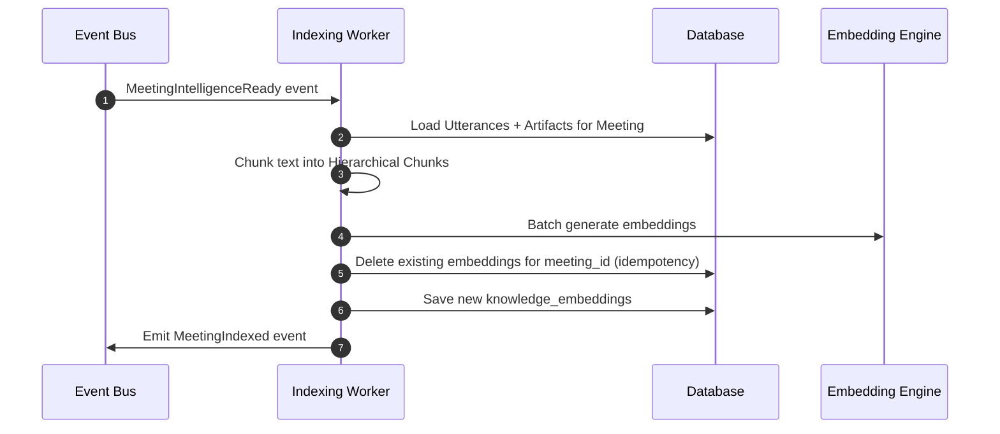

# RFC-004: Knowledge Index Bounded Context

This RFC defines the architectural boundaries, indexing pipelines, vector database mapping, hybrid retrieval strategies, and citation validation framework for the **Knowledge Index Bounded Context** within the **Noted Ma'am** Meeting Operating System.

---

## 1. Context Boundaries & Responsibilities

The Knowledge Index Context is responsible for transforming raw transcript utterances and meeting intelligence artifacts into dense vectors, indexing them into vector databases, and providing semantic retrieval interfaces.

It has zero knowledge of ASR/diarization models or LLM summaries. It strictly consumes structured text outputs and coordinates vector indexing and query-time retrieval.

```
[Meeting Intelligence Context]
          │
          │ (MeetingIntelligenceReady Event)
          ▼
┌─────────────────────────────────────────────────────────────────────────────┐
│ Knowledge Index Bounded Context                                            │
│                                                                             │
│  [MeetingIntelligenceReady Consumer]                                        │
│          │                                                                  │
│          ├──> [Hierarchical Text Chunker]                                   │
│          │         ├── Utterance Chunking                                   │
│          │         └── Artifact Chunking                                    │
│          │                                                                  │
│          ├──> [Embedding Generator] (Configurable models e.g. text-embedding)│
│          │                                                                  │
│          └──> [Vector Database Store] (PostgreSQL + pgvector / SQLite extension)│
│                                                                             │
│  [Retrieval Engine]                                                         │
│          ├──> [Hybrid Searcher] (BM25 + Semantic Vector Search)             │
│          ├──> [Cross-Encoder Reranker]                                      │
│          └──> [Citation Verifier] (Ensures results link to database IDs)    │
│                                                                             │
│                       ──> MeetingIndexed Event                              │
└─────────────────────────────────────────────────────────────────────────────┘
                                │
                                ▼
                      [Search / RAG Context]
```

### Core Invariants

1. **Isolation of Storage**: Vector search tables or collection indices are mapped inside the Knowledge Index boundary. The Meeting or Speech context cannot perform direct vector queries.
2. **Deterministic Citations**: All retrieved search results must map back to active entity IDs (utterances, decisions, actions) in the primary SQL database.
3. **Correlation**: Document chunks must keep parent references (`meeting_id`, `transcript_id`, `utterance_id` or `artifact_id`) for filtering and context reconstruction.
4. **Idempotency**: Re-indexing a meeting replaces all its previous vector chunks to avoid duplicate results.

---

## 2. Text Chunking Strategy

Standard character-length chunking splits paragraphs arbitrarily, breaking semantic coherence. The Knowledge Index Context uses **Hierarchical Semantic Chunking**:

### 2.1 Utterance Chunks

Instead of splitting raw strings, we chunk by groups of speaker utterances:
- **Chunk Size**: ~300-500 words (~15-20 contiguous utterances).
- **Overlapping**: 3 utterances (prevents context loss at boundaries).
- **Metadata**:
  - `meeting_id`: UUID
  - `transcript_id`: UUID
  - `start_utterance_id`: UUID (first utterance in chunk)
  - `end_utterance_id`: UUID (last utterance in chunk)
  - `speaker_tags`: List of speakers active in this chunk

### 2.2 Artifact Chunks

Each Meeting Intelligence artifact (Summary key topics, Action Items, Decisions, Conflicts) is indexed as an independent chunk:
- **Chunk Content**: Formatted string representation of the artifact (e.g. `"Decision: Adopt outbox pattern. Rationale: Guarantees consistency."`).
- **Metadata**:
  - `meeting_id`: UUID
  - `artifact_type`: e.g. `"decision"`, `"action_item"`
  - `artifact_id`: UUID (direct reference for provenance)
  - `source_utterance_ids`: List of supporting utterances

---

## 3. Database Schema (SQLite / pgvector)

To support local testing and production deployment, database structures are mapped dynamically.

### PostgreSQL Production Schema (`pgvector`)

```sql
-- Enable vector extension
CREATE EXTENSION IF NOT EXISTS vector;

-- Vector Index Table
CREATE TABLE knowledge_embeddings (
    id UUID PRIMARY KEY,
    meeting_id UUID NOT NULL,
    chunk_type VARCHAR(50) NOT NULL, -- "utterance", "artifact"
    parent_id UUID NOT NULL,          -- utterance_id or artifact_id
    text_content TEXT NOT NULL,
    embedding VECTOR(768) NOT NULL,   -- e.g. 768-dim (Gemini embedding / local model)
    metadata JSONB NOT NULL,          -- speakers, start/end timestamps, tags
    created_at TIMESTAMP WITH TIME ZONE DEFAULT CURRENT_TIMESTAMP
);

-- Indexing for Cosine similarity
CREATE INDEX ON knowledge_embeddings USING hnsw (embedding vector_cosine_ops);
CREATE INDEX ON knowledge_embeddings (meeting_id);
```

### SQLite Test Schema

For testing, vector coordinates are stored in standard tables with float lists, or utilizing the sqlite-vss extension where supported:

```sql
CREATE TABLE knowledge_embeddings (
    id CHAR(36) PRIMARY KEY,
    meeting_id CHAR(36) NOT NULL,
    chunk_type VARCHAR(50) NOT NULL,
    parent_id CHAR(36) NOT NULL,
    text_content TEXT NOT NULL,
    embedding_json TEXT NOT NULL,     -- JSON array representing floats
    metadata TEXT NOT NULL,           -- JSON serialized metadata
    created_at TIMESTAMP NOT NULL
);
```

---

## 4. Embedding Engine Abstraction

The context abstracts embedding generation through the `EmbeddingEngine` interface:

```python
class EmbeddingEngine(ABC):
    @abstractmethod
    def generate_embedding(self, text: str) -> List[float]:
        """Generates dense vector representation of text."""
        pass

    @abstractmethod
    def generate_embeddings_batch(self, texts: List[str]) -> List[List[float]]:
        """Generates dense vectors in batch to minimize round-trips."""
        pass
```

### Supported Providers
1. **MockEmbeddingEngine** (Default): Returns deterministic random or hash-based floats. Essential for testing without API keys.
2. **GeminiEmbeddingEngine**: Production implementation wrapping Google's text-embedding models.

---

## 5. Retrieval & Search Engine

To optimize precision and recall, the query engine implements **Hybrid Retrieval & Reranking**:

```
           [Search Query]
                 │
         ┌───────┴───────┐
         ▼               ▼
  [Semantic Search]   [BM25 Text Search]
    (Dense vector)       (Keyword Index)
         │               │
         └───────┬───────┘
                 ▼
     [Reciprocal Rank Fusion]
                 ▼
      [Cross-Encoder Reranker]
                 ▼
      [Citation Verification]
                 ▼
         [Ranked Results]
```

### 5.1 Reciprocal Rank Fusion (RRF)
Vector search is excellent at conceptual matching but poor at exact keyword matching (e.g. acronyms, specific product names). RRF merges both results:

$$RRF\_Score(d) = \sum_{m \in M} \frac{1}{60 + r_m(d)}$$

where $r_m(d)$ is the rank of document $d$ in search method $m$.

### 5.2 Cross-Encoder Reranker
The top 25 merged candidate chunks are passed through a lightweight Cross-Encoder model (or local utility) to re-evaluate the relevance between the user's query and the document text, producing a refined relevance score.

### 5.3 Citation Verification
Before returning results, the engine verifies that the referenced `parent_id` (utterance or artifact) still exists in the primary database (not soft-deleted or modified) to guarantee data integrity.

---

## 6. Worker Orchestration


